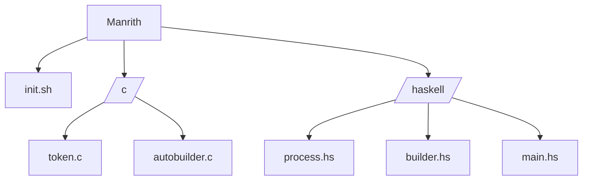

# Manrith
Manrith is a hybrid evolutionary algorithm, written in pure Haskell and pure C, designed to demonstrate two fundamental properties:
- **Self-construction**: individuals have genomes of variable size. The algorithm can dynamically add or remove genes, expanding or reducing their structure as needed.
- **Self-adaptation**: each individual carries strategy parameters (mutation rate, crossover factor, length bias) that also evolve along with the genes. Additionally, the weights of global operators (mutation, crossover, and constructive) are automatically adjusted based on their performance.

---

## Run easily
How to execute? [Click here](https://github.com/Quikert/Manrith/blob/main/README.md#execution)

---

## Structure for fools


----

## How does it work?

#### Tokenizer
- Generates a random seed and initial parameters (probabilities, genome limits, etc.).
- And these values ​​are passed to the Haskell algorithm

#### Evolutionary core
- Implements mutation, crossover and adaptive construction operators.
- Defines the fitness function (comparison with a target vector).
- Executes the evolutionary cycle in phases, calling the C autobuilder to recalibrate the weights of the operators.

#### Autobuilder
- Receives success statistics from operators and returns new normalized weights.
- This ensures that the algorithm favors more effective operators across generations

---

## Features
- **Variable genomes**: individuals can grow or shrink dynamically.
- **Internal evolutionary parameters**: each individual carries its own mutation and crossover rate.
- **C + Haskell integration**: C provides initialization and weight adjustment; Haskell runs the evolutionary core.

---

## Execution
- After cloning the repository with git, just type this: `cd Manrith && chmod a+x init.sh && ./init.sh`
- The output should look like:
```bash
+ Compiling tokenization file './c/token.c
```
- After a few seconds the top line goes out and appears on the same line:
```bash
+ Compiled file: './c/token.c'!
```
- After:
```bash
+ Compiling autobuilder file './c/autobuilder.c'
```
- After:
```bash
+ Compiled file './c/autobuilder.c'!
```
- After:
```bash
+ Compiling './haskell/*.hs' components
```
- After:
```bash
+ Compiled components! './haskell/*.hs'
```
- So far, all files are already compiled
- Here it starts to generate genes and tokenize:
```bash
+ Creating construction tokens
WM=0.340000
WC=0.330000
WK=0.330000
MINLEN=2
MAXLEN=24
STEPSTD=0.150000
RANGE_LO=-1.000000
RANGE_HI=1.000000
ADD_BASE=0.250000
REM_BASE=0.200000
```
- Here it runs the autobuilder algorithm in haskell.
```bash
+ Running Haskell algorithm
```
- Delete `build.txt > /dev/null 2>&1;` in `./main < tokens.txt > build.txt > /dev/null 2>&1;` init.sh if you want to see the creation live.

---

## Detailed documentation
- Documentation with minimal details of what Haskell does: [Haskell Manrith DOC](https://github.com/Quikert/Manrith/haskell/doc-hs.txt)
- Documentation with minimal details of what C does: [C Manrith DOC](https://github.com/Quikert/Manrith/c/doc-c.txt)
- Documentation with minimal details of what Init does: [Init/Shell Manrith DOC](https://github.com/Quikert/Manrith/doc.txt)

---

> Powered by @Quikert
> 
